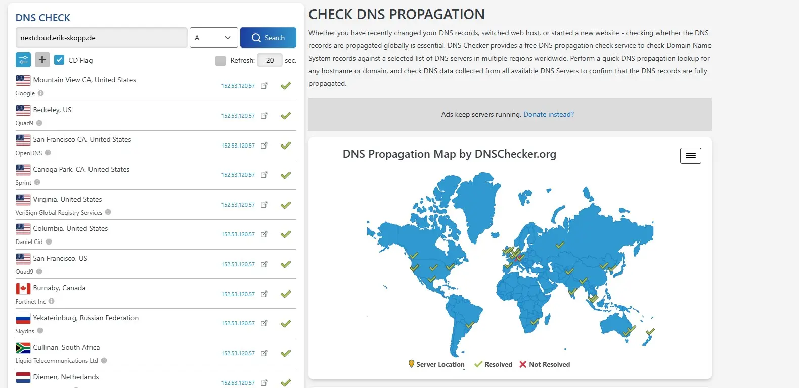

# Anlegen einer Nextcloud Instanz auf einem Alpine Server mit Caddy
## DNS-Konfiguration für die Subdomain

Um den Server über eine Domain oder Subdomain erreichbar zu machen, ist die Erstellung eines entsprechenden DNS-Records erforderlich. In diesem Fall wird die Domain ``erik-skopp.de`` genutzt und eine Third-Level-Domain mit dem Namen ``nextcloud`` angelegt. Daraus ergibt sich die finale Subdomain: ``nextcloud.erik-skopp.de``.

### Anlegen der Records

Diese Subdomain dient ausschließlich zu Testzwecken. Nach Abschluss dieses Berichts werden sowohl der Webserver als auch die Nextcloud-Installation sowie die zugehörigen DNS-Einträge entfernt.

Zur Vereinfachung werden hier nur zwei Domains verwendet:

- Der **A-Record** weist die Domain der IPv4-Adresse `152.53.120.57` zu.
- Der **AAAA-Record** löst `nextcloud.erik-skopp.de` auf IPv6 auf, nämlich auf `2a0a:4cc0:c0:4540::1`.

Für dieses Projekt nutze ich einen **Netcup-Server**, der einen **/64-Adresspool** bereitstellt. Konkret sind dies:

- **Link-Local-Adresse:** `fe80::a8cb:d0ff:fe50:ab47/10` (nicht von außen erreichbar)
- **Global Unicast-Subnetz:** `2a0a:4cc0:c0:4540::/64` (öffentlich routbar)

Da die **Link-Local-Adresse (`fe80::.../10`) nicht extern erreichbar** ist, bleibt nur die **routbare Global Unicast-Adresse**. 
Aus dem `/64`-Adresspool habe ich die `:1` als Host-Adresse gewählt – dies geschah aus rein praktischen Gründen und hat keinen Einfluss auf den weiteren Ablauf.


### Testen der Records

### DNS-Checker
Die Überprüfung der DNS-Einträge erfolgt auf zwei Wegen. Eine Möglichkeit bietet die externe Website [DNSChecker](https://dnschecker.org/#A/nextcloud.erik-skopp.de). Dort kann die gewünschte URL eingegeben und der zu überprüfende DNS-Record ausgewählt werden. Die Ergebnisse werden übersichtlich dargestellt und zeigen, in welchen Regionen der Eintrag bereits propagiert wurde und wo er noch aussteht.



#### DIG 
> dig (Domain Information Groper) ist ein leistungsstarkes Kommandozeilen-Tool zum Abfragen von DNS-Informationen. Es wird häufig von Netzwerkadministratoren und Entwicklern [...] genutzt, um DNS-Records von Domains zu analysieren. (Quelle: verschiedene)[^2]

Wir nutzen dig um mit einem CLI Tool zu prüfen ob die DNS Einträge für die Nextcloud Domain vorhanden sind. Auf Gründen der einfachheit werde ich hier nur auf den `IPv4` bzw `A-Record` eingehen, da nur dieser hier relevant ist. Für den anderen Record bedarf es keine Änderung. Auf dem Server werden beide in der Caddy Config abgefangen. 


```bash
> dig nextcloud.erik-skopp.de

; <<>> DiG 9.18.30-0xxx <<>> nextcloud.erik-skopp.de
;; global options: +cmd
;; Got answer:
;; ->>HEADER<<- opcode: QUERY, status: NOERROR, id: 8998
;; flags: qr rd ra; QUERY: 1, ANSWER: 1, AUTHORITY: 0, ADDITIONAL: 1

;; OPT PSEUDOSECTION:
; EDNS: version: 0, flags:; udp: 512
;; QUESTION SECTION:
;nextcloud.erik-skopp.de.       IN      A

;; ANSWER SECTION:
nextcloud.erik-skopp.de. 182    IN      A       152.53.120.57

;; Query time: 49 msec
;; SERVER: 10.255.255.254#53(10.255.255.254) (UDP)
;; WHEN: Fri Feb 07 10:17:31 CET 2025
;; MSG SIZE  rcvd: 68
```
In der Antwortsektion ist zu erkennen, dass der Server den A-Record erfolgreich aufgelöst hat. Daher können wir uns nun der Serverkonfiguration widmen.


## Einrichten des Servers

### Grundgedanke
In den meisten Linux-Distributionen werden Websites standardmäßig im Verzeichnis `/var/www` abgelegt. Daher erstellen wir dort den Ordner `nextcloud`, der als Hauptverzeichnis für Nextcloud dient. Die Nutzerdaten hingegen werden in `/home/data/` gespeichert. Diese Trennung ist essenziell, da sie die Verwaltung von Zugriffsrechten erleichtert und die Struktur übersichtlicher hält.

Anschließend konfigurieren wir Caddy so, dass es die Index-Dateien aus dem Verzeichnis `/var/www/nextcloud` lädt. Da Nextcloud PHP erfordert, verwenden wir die aktuelle Version 8.3, die über den `PHP FastCGI Socket` eingebunden wird. PHP FastCGI (Fast Common Gateway Interface) ist eine optimierte Methode zur Kommunikation zwischen einem Webserver und der PHP-Interpreter-Instanz. Im Gegensatz zum klassischen CGI, bei dem für jede Anfrage ein neuer PHP-Prozess gestartet wird, hält FastCGI persistente Prozesse bereit, die mehrere Anfragen effizient verarbeiten können. Dies reduziert den Overhead und verbessert die Leistung von PHP-Anwendungen erheblich.

Ein `sock` (Socket) ist eine Datei, die als Kommunikationsschnittstelle zwischen zwei Prozessen auf demselben System dient. In diesem Fall ermöglicht ein Unix-Domain-Socket die direkte und schnelle Kommunikation zwischen dem Webserver (Caddy) und der PHP-FPM-Instanz. Der Webserver übergibt Anfragen an diesen Socket, woraufhin PHP-FPM die Anfragen verarbeitet und die Antworten zurückliefert.

Als Datenbank setzen wir MariaDB ein, um die erforderlichen Daten für Nextcloud zu verwalten.

Mit dieser Konfiguration ist die grundlegende Einrichtung abgeschlossen.


### Grundlagen von Alpine
In diesem Projekt verwenden wir Alpine Linux in der Version `3.21.3`, die über die offizielle [Alpine-Downloadseite](https://alpinelinux.org/downloads/) verfügbar ist. Wir gehen davon aus, dass eine installierte und funktionsfähige Alpine-Version bereits vorhanden ist.

Um Alpine aktuell zu halten und um es zu aktualisieren empfiehlt es sich ein update durchzuführen. 

```sh
apk update 
apk upgrade  
```

Ähnlich wie bei anderen Distributionen aktualisiert `apk update` die Paketlisten und `apk upgrade` die Packages anhand der Packetlisten.


### Erstellen der Ordnerstruktur
```bash
mkdir -p /home/data
cd /var/www
mkdir -p nextcloud.erik-skopp.de
cd ~
cd nextcloud.erik-skopp.de/
```
Für die Nextcloud-Installation benötigen wir lediglich zwei Verzeichnisse: [^3]

1. `/home/data` – Dieses Verzeichnis dient als Speicherort für die Nutzerdaten. Durch die Trennung von Anwendungs- und Nutzerdaten wird die Verwaltung von Zugriffsrechten vereinfacht und die Datensicherheit erhöht.
   
2. `/var/www/nextcloud.erik-skopp.de` – Hier wird die Nextcloud-Installation selbst abgelegt. Dieses Verzeichnis enthält alle erforderlichen Dateien für den Betrieb von Nextcloud.

Diese klare Trennung sorgt für eine bessere Organisation und erleichtert zukünftige Wartungsarbeiten.

### Herunterladen von Nextcloud
Zunächst laden wir die Datei `latest.zip` herunter und entpacken sie in das vorgesehene Verzeichnis. Alpine bietet in der Dokumentation ein `nextcloud-initscript`[^4], das diesen Prozess automatisiert. Im Wesentlichen führt das Skript dieselben Schritte aus, mit dem Unterschied, dass es zusätzlich die erforderlichen PHP-Abhängigkeiten installiert.

Da wir das System manuell einrichten, müssen wir die benötigten PHP-Pakete selbst installieren, um sicherzustellen, dass Nextcloud reibungslos


### Installation von PHP 8.3
```bash 
apk add php83 php83-fpm php83-mysqli php83-json php83-openssl \
    php83-curl php83-gd php83-intl php83-mbstring php83-xml \
    php83-zip php83-bcmath php83-gmp php83-exif php83-fileinfo \
    php83-pcntl php83-posix php83-session php83-simplexml \
    php83-tokenizer php83-iconv php83-dom php83-xmlreader \
    php83-xmlwriter php83-pdo php83-pdo_mysql php83-opcache
```

## Sonstiges
### Titelbild
Das Titelbild stammt von Pixabay.[^1]

[^1]: [Quelle: AI-generiert Cloud Computing Mining auf Pixabay](https://pixabay.com/de/illustrations/ai-generiert-cloud-computing-bergbau-8533603/)
[^2]: [Wikipedia Dig Software](https://de.wikipedia.org/wiki/Dig_(Software))
[^3]: Diese Trennung habe ich mir vor etlichen Jahren abgeschaut und finde sie bis heute sinnvoll. Sie sorgt für eine klare Struktur, erleichtert die Verwaltung von Zugriffsrechten und verbessert die Wartbarkeit des Systems. Während sich `/home/data` ausschließlich um die Speicherung der Nutzerdaten kümmert, bleibt `/var/www/nextcloud.erik-skopp.de` auf die Anwendung selbst beschränkt. Dadurch lassen sich Backups gezielter anfertigen und Berechtigungen besser steuern.
[Apfelcast - Nextcloud und Nginx](https://apfelcast.com/nextcloud-28-hub-7-installation-einfache-anleitung-auf-linux-server-inkl-domain-ssl/)
[^4]:[Nextcloud im Alpine Wiki](https://wiki.alpinelinux.org/wiki/Nextcloud#Webserver)