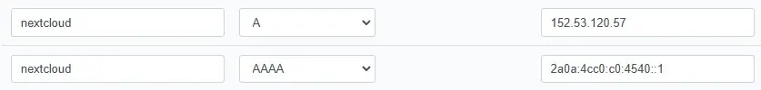
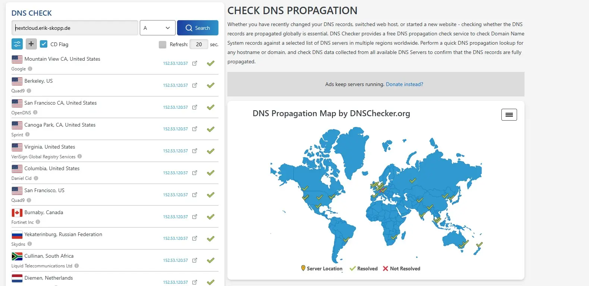
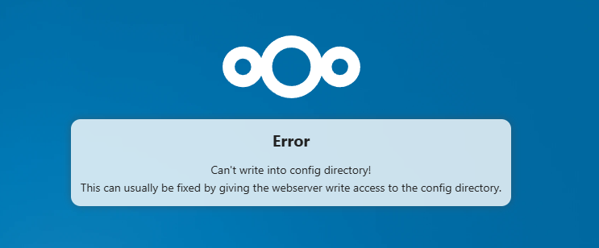
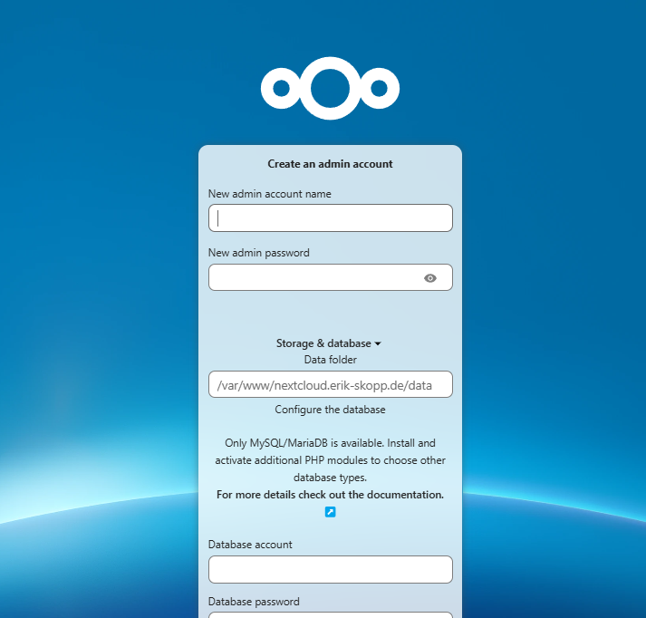
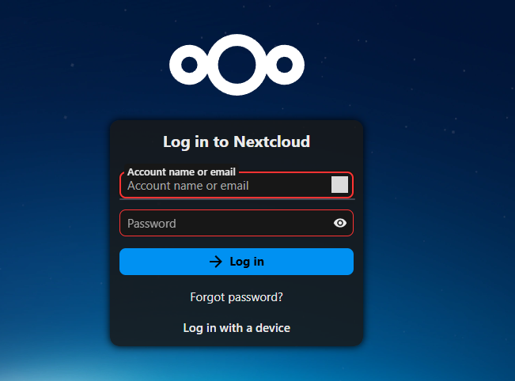

# Anlegen einer Nextcloud Instanz auf einem Alpine Server mit Caddy

## DNS-Konfiguration für die Subdomain

Um den Server über eine Domain oder Subdomain erreichbar zu machen, ist die Erstellung eines entsprechenden DNS-Records erforderlich. In diesem Fall wird die Domain `erik-skopp.de` genutzt und eine Third-Level-Domain mit dem Namen `nextcloud` angelegt. Daraus ergibt sich die finale Subdomain: `nextcloud.erik-skopp.de`.

### Anlegen der Records

Diese Subdomain dient ausschließlich zu Testzwecken. Nach Abschluss dieses Berichts werden sowohl der Webserver als auch die Nextcloud-Installation sowie die zugehörigen DNS-Einträge entfernt.

Zur Vereinfachung werden hier nur zwei Domains verwendet:

- Der `A-Record` weist die Domain der IPv4-Adresse `152.53.120.57` zu.
- Der `AAAA-Record` löst `nextcloud.erik-skopp.de` auf IPv6 auf, nämlich auf `2a0a:4cc0:c0:4540::1`.

Für dieses Projekt nutze ich einen `Netcup-Server`, der einen `/64-Adresspool` bereitstellt. Konkret sind dies:

- `Link-Local-Adresse:` `fe80::a8cb:d0ff:fe50:ab47/10` (nicht von außen erreichbar)
- `Global Unicast-Subnetz:` `2a0a:4cc0:c0:4540::/64` (öffentlich routbar)

Da die `Link-Local-Adresse (`fe80::.../10`) nicht extern erreichbar` ist, bleibt nur die `routbare Global Unicast-Adresse`.
Aus dem `/64`-Adresspool habe ich die `:1` als Host-Adresse gewählt – dies geschah aus rein praktischen Gründen und hat keinen Einfluss auf den weiteren Ablauf.



### Testen der Records

### DNS-Checker

Die Überprüfung der DNS-Einträge erfolgt auf zwei Wegen. Eine Möglichkeit bietet die externe Website [DNSChecker](https://dnschecker.org/#A/nextcloud.erik-skopp.de). Dort kann die gewünschte URL eingegeben und der zu überprüfende DNS-Record ausgewählt werden. Die Ergebnisse werden übersichtlich dargestellt und zeigen, in welchen Regionen der Eintrag bereits propagiert wurde und wo er noch aussteht.



#### DIG

> dig (Domain Information Groper) ist ein leistungsstarkes Kommandozeilen-Tool zum Abfragen von DNS-Informationen. Es wird häufig von Netzwerkadministratoren und Entwicklern [...] genutzt, um DNS-Records von Domains zu analysieren. (Quelle: verschiedene)[^2]

Wir nutzen dig um mit einem CLI Tool zu prüfen ob die DNS Einträge für die Nextcloud Domain vorhanden sind. Auf Gründen der einfachheit werde ich hier nur auf den `IPv4` bzw `A-Record` eingehen, da nur dieser hier relevant ist. Für den anderen Record bedarf es keine Änderung. Auf dem Server werden beide in der Caddy Config abgefangen.

```bash
> dig nextcloud.erik-skopp.de

; <<>> DiG 9.18.30-0xxx <<>> nextcloud.erik-skopp.de
;; global options: +cmd
;; Got answer:
;; ->>HEADER<<- opcode: QUERY, status: NOERROR, id: 8998
;; flags: qr rd ra; QUERY: 1, ANSWER: 1, AUTHORITY: 0, ADDITIONAL: 1

;; OPT PSEUDOSECTION:
; EDNS: version: 0, flags:; udp: 512
;; QUESTION SECTION:
;nextcloud.erik-skopp.de.       IN      A

;; ANSWER SECTION:
nextcloud.erik-skopp.de. 182    IN      A       152.53.120.57

;; Query time: 49 msec
;; SERVER: 10.255.255.254#53(10.255.255.254) (UDP)
;; WHEN: Fri Feb 07 10:17:31 CET 2025
;; MSG SIZE  rcvd: 68
```

In der Antwortsektion ist zu erkennen, dass der Server den A-Record erfolgreich aufgelöst hat. Daher können wir uns nun der Serverkonfiguration widmen.

## Einrichten des Servers

### Grundgedanke

In den meisten Linux-Distributionen werden Websites standardmäßig im Verzeichnis `/var/www` abgelegt. Daher erstellen wir dort den Ordner `nextcloud`, der als Hauptverzeichnis für Nextcloud dient. Die Nutzerdaten hingegen werden in `/home/data/` gespeichert. Diese Trennung ist essenziell, da sie die Verwaltung von Zugriffsrechten erleichtert und die Struktur übersichtlicher hält.

Anschließend konfigurieren wir Caddy so, dass es die Index-Dateien aus dem Verzeichnis `/var/www/nextcloud` lädt. Da Nextcloud PHP erfordert, verwenden wir die aktuelle Version 8.3, die über den `PHP FastCGI Socket` eingebunden wird. PHP FastCGI (Fast Common Gateway Interface) ist eine optimierte Methode zur Kommunikation zwischen einem Webserver und der PHP-Interpreter-Instanz. Im Gegensatz zum klassischen CGI, bei dem für jede Anfrage ein neuer PHP-Prozess gestartet wird, hält FastCGI persistente Prozesse bereit, die mehrere Anfragen effizient verarbeiten können. Dies reduziert den Overhead und verbessert die Leistung von PHP-Anwendungen erheblich.

Ein `sock` (Socket) ist eine Datei, die als Kommunikationsschnittstelle zwischen zwei Prozessen auf demselben System dient. In diesem Fall ermöglicht ein Unix-Domain-Socket die direkte und schnelle Kommunikation zwischen dem Webserver (Caddy) und der PHP-FPM-Instanz. Der Webserver übergibt Anfragen an diesen Socket, woraufhin PHP-FPM die Anfragen verarbeitet und die Antworten zurückliefert.

Als Datenbank setzen wir MariaDB ein, um die erforderlichen Daten für Nextcloud zu verwalten.

Mit dieser Konfiguration ist die grundlegende Einrichtung abgeschlossen.

### Grundlagen von Alpine

In diesem Projekt verwenden wir Alpine Linux in der Version `3.21.3`, die über die offizielle [Alpine-Downloadseite](https://alpinelinux.org/downloads/) verfügbar ist. Wir gehen davon aus, dass eine installierte und funktionsfähige Alpine-Version bereits vorhanden ist.

Um Alpine aktuell zu halten und um es zu aktualisieren empfiehlt es sich ein update durchzuführen.

```sh
apk update
apk upgrade
```

Ähnlich wie bei anderen Distributionen aktualisiert `apk update` die Paketlisten und `apk upgrade` die Packages anhand der Packetlisten.

### Erstellen der Ordnerstruktur

```bash
mkdir -p /home/data
cd /var/www
mkdir -p nextcloud.erik-skopp.de
cd ~
cd nextcloud.erik-skopp.de/
```

Für die Nextcloud-Installation benötigen wir lediglich zwei Verzeichnisse: [^3]

1. `/home/data` – Dieses Verzeichnis dient als Speicherort für die Nutzerdaten. Durch die Trennung von Anwendungs- und Nutzerdaten wird die Verwaltung von Zugriffsrechten vereinfacht und die Datensicherheit erhöht.
2. `/var/www/nextcloud.erik-skopp.de` – Hier wird die Nextcloud-Installation selbst abgelegt. Dieses Verzeichnis enthält alle erforderlichen Dateien für den Betrieb von Nextcloud.

Diese klare Trennung sorgt für eine bessere Organisation und erleichtert zukünftige Wartungsarbeiten.

### Herunterladen von Nextcloud

Zunächst laden wir die Datei `latest.zip` herunter und entpacken sie in das vorgesehene Verzeichnis. Alpine bietet in der Dokumentation ein `nextcloud-initscript`[^4], das diesen Prozess automatisiert. Im Wesentlichen führt das Skript dieselben Schritte aus, mit dem Unterschied, dass es zusätzlich die erforderlichen PHP-Abhängigkeiten installiert.

Da wir das System manuell einrichten, müssen wir die benötigten PHP-Pakete selbst installieren, um sicherzustellen, dass Nextcloud reibungslos funktioniert.

```bash
cd /var/www/nextcloud.erik-skopp.de
wget https://download.nextcloud.com/server/releases/latest.zip
unzip latest.zip
mv nextcloud/* .
rm -rf nextcloud/
rm latest.zip
```

Mit wget laden wir das ZIP-Archiv von Nextcloud herunter. Es ist wichtig, die Version latest zu verwenden, da nur so die neuesten Sicherheitsupdates und Funktionen enthalten sind.

Anschließend entpacken wir das ZIP-Archiv, wodurch die Dateien in einem zusätzlichen Unterordner nextcloud abgelegt werden. Da dieser zusätzliche Ordner nicht benötigt wird, verschieben wir den Inhalt direkt in unseren Zielordner nextcloud.erik-skopp.de. Abschließend löschen wir das ursprüngliche latest.zip-Archiv sowie den nun leeren nextcloud-Ordner.

Nun sollte das ganze in etwa so aussehen:

```bash
localhost:/var/www/nextcloud.erik-skopp.de# ls
3rdparty           apps               console.php        index.html         ocs                public.php         status.php
AUTHORS            composer.json      core               index.php          ocs-provider       remote.php         themes
COPYING            composer.lock      cron.php           lib                package-lock.json  resources          updater
LICENSES           config             dist               occ                package.json       robots.txt         version.php
```

### Installation von PHP 8.3

```bash
apk add php83 php83-fpm php83-mysqli php83-json php83-openssl \
    php83-curl php83-gd php83-intl php83-mbstring php83-xml \
    php83-zip php83-bcmath php83-gmp php83-exif php83-fileinfo \
    php83-pcntl php83-posix php83-session php83-simplexml \
    php83-tokenizer php83-iconv php83-dom php83-xmlreader \
    php83-xmlwriter php83-pdo php83-pdo_mysql php83-opcache
```

Um PHP allein nutzen zu können, reicht es aus, den Befehl `apk add php83 php83-fpm` auszuführen. Nextcloud erfordert jedoch zusätzliche PHP-Erweiterungen für seine Kernfunktionen und Plugins. Um nicht jede Erweiterung einzeln zu installieren, kann man mit diesem Befehl die wichtigsten Extensions direkt hinzufügen.

### Installation von Caddy

```bash
apk add caddy
```

Caddy ist ein moderner, leistungsstarker Webserver und Reverse Proxy, der sich durch einfache Konfiguration, automatische HTTPS-Unterstützung und geringe Systemanforderungen auszeichnet. Er ist in Go geschrieben und wird oft als Alternative zu Nginx oder Apache verwendet.

Wie alle Webserver basiert Caddy auf Konfigurationsdateien, die nun bearbeitet werden müssen. Ein wesentlicher Unterschied zu Apache und Nginx besteht darin, dass Caddy die Verwaltung von SSL/TLS-Zertifikaten automatisch übernimmt. [^5]

```bash
rc-service caddy start
```

In Alpine müssen alle sockets und Dienste manuell gestartet werden. Man kann das einfach mit `systemctl caddy start` aus Debian 12 vergleichen. Ohne den Start ist Caddy nicht nutzbasr. Debian nutzt systemd und Alpine nutzt OpenRC.

### Einrichten von Caddy

Die Konfigurationsdatei von Caddy befindet sich unter `/etc/caddy/Caddyfile` und kann als normale Textdatei bearbeitet werden. Dafür eignet sich nano, alternativ kann auch vim oder ein anderer Editor verwendet werden.

```bash
nano /etc/caddy/Caddyfile
```

Diese `Caddyfile` definiert die Konfiguration für die Domain `nextcloud.erik-skopp.de` und stellt sicher, dass Nextcloud über Caddy als Webserver korrekt betrieben wird.

```Caddy
# Caddy's configuration file
# see: https://caddyserver.com/docs/caddyfile

nextcloud.erik-skopp.de {
        root * /var/www/nextcloud.erik-skopp.de
        file_server
        php_fastcgi unix//run/php-fpm83/php-fpm.sock

        header {
                Strict-Transport-Security "max-age=31536000; includeSubDomains; preload"
                Referrer-Policy "no-referrer"
                X-Content-Type-Options "nosniff"
                X-Frame-Options "SAMEORIGIN"
                X-XSS-Protection "1; mode=block"
        }
}
```

Diese Caddyfile definiert die Konfiguration für die Domain `nextcloud.erik-skopp.de` und stellt sicher, dass Nextcloud über Caddy als Webserver korrekt betrieben wird.

Zunächst wird die Domain `nextcloud.erik-skopp.de` als Hostname festgelegt, sodass Caddy Anfragen für diese Domain verarbeitet. Danach wird das `Root-Verzeichnis` für Nextcloud auf `/var/www/nextcloud.erik-skopp.de` gesetzt, wodurch alle statischen Dateien und PHP-Skripte von dort geladen werden. Die Zeile `file_server` aktiviert den Dateiserver von Caddy, sodass statische Inhalte wie Bilder, CSS und JavaScript direkt ausgeliefert werden können.

Für die PHP-Verarbeitung wird `php_fastcgi unix//run/php-fpm83/php-fpm.sock` verwendet. Dadurch werden PHP-Anfragen an einen PHP-FPM 8.3 Socket weitergeleitet, was für die korrekte Ausführung von Nextcloud erforderlich ist.

Zusätzlich werden mehrere `Sicherheits-Header` gesetzt, um die Nextcloud-Instanz besser abzusichern. `Strict-Transport-Security` (HSTS) sorgt dafür, dass HTTPS für ein Jahr erzwungen wird und auch Subdomains betrifft. `Referrer-Policy` verhindert, dass der Browser Referrer-Informationen an externe Seiten sendet. `X-Content-Type-Options` unterbindet das MIME-Type-Sniffing und erschwert so Angriffe. `X-Frame-Options` schützt vor Clickjacking, indem das Einbetten der Seite in Frames blockiert wird. Schließlich aktiviert `X-XSS-Protection` den XSS-Schutz im Browser.

Diese `Caddyfile` ermöglicht eine sichere und optimierte Bereitstellung von Nextcloud auf der Domain `nextcloud.erik-skopp.de`. Caddy übernimmt die Verwaltung von `statischen Dateien`, `PHP-Verarbeitung` und `Sicherheitsmechanismen`, wodurch eine stabile und geschützte Umgebung für Nextcloud gewährleistet wird.

Wenn die Config fertig ist, kann man sie formatieren. Dies sollte man tun, da sonst OpenRC sich beschwert.

```bash
caddy fmt --overwrite /etc/caddy/Caddyfile
```

Anschließend muss Caddy neu gestartet werden. Dies ist wichtig, damit er die Config neu einliest.

```bash
rc-service caddy restart
```

### Aktivieren von PHP8.3

Das starten von PHP8.3 hat sich immer als etwas schwierig herausgestellt.

```bash
rc-update add php-fpm83 default
rc-service php-fpm83 restart
```

Jetzt geht es um die PHP config

```bash
nano /etc/php83/php-fpm.d/www.conf
```

Anschließend sind einige Anpassungen in der Datei `/etc/php83/php-fpm.d/www.conf` erforderlich. Ich empfehle, die Datei vollständig zu löschen, da nur wenige Konfigurationen benötigt werden. Diese werde ich nun im Detail erläutern.

```bash
[www]
;listen = 127.0.0.1:9000
;user = nobody
;#group = nobody
;#listen.owner = nobody
;listen.group = nobody
;listen.mode = 0666
;pm = dynamic
;pm.max_children = 50
;pm.start_servers = 5
;pm.min_spare_servers = 5
;pm.max_spare_servers = 35


user = caddy
group = caddy
listen = /run/php-fpm83/php-fpm.sock
listen.owner = caddy
listen.group = caddy
listen.mode = 0660
pm = dynamic
pm.max_children = 10
pm.start_servers = 2
pm.min_spare_servers = 1
pm.max_spare_servers = 5
```

> Ich habe die alte config oben als Kommentar in der Datei beibehalten. Das macht das Fehler debugging einfacher.
> Die Konfiguration für `PHP-FPM 8.3` setzt verschiedene Parameter für den Betrieb des PHP-Prozesses unter dem Benutzer `caddy`. Die einzelnen Zeilen haben folgende Bedeutung:

- `user = caddy` und `group = caddy`  
  Diese Zeilen legen fest, dass `PHP-FPM` als der Benutzer `caddy` in der Gruppe `caddy` ausgeführt wird. Dies ist wichtig, um eine saubere Rechteverwaltung zu gewährleisten und sicherzustellen, dass `PHP`-Prozesse unter dem Webserver-Benutzer laufen.

- `listen = /run/php-fpm83/php-fpm.sock`  
  Diese Einstellung definiert, dass `PHP-FPM` über eine **Unix-Socket-Datei** (`/run/php-fpm83/php-fpm.sock`) statt über eine **TCP-Adresse** (`127.0.0.1:9000`) kommuniziert.  
  Die Nutzung einer **Unix-Socket-Verbindung** hat mehrere Vorteile:

  - Sie ist schneller als eine `TCP`-Verbindung, da sie ohne Netzwerk-Overhead direkt auf dem Dateisystem operiert.
  - Sie ist sicherer, da keine Netzwerkverbindung geöffnet wird, wodurch Angriffe von außen ausgeschlossen sind.
  - Sie reduziert die Ressourcennutzung, insbesondere bei lokalen Webservern wie `Caddy` oder `Nginx`.

- `listen.owner = caddy` und `listen.group = caddy`  
  Diese Einstellungen definieren, dass der `Caddy`-Server vollen Zugriff auf die `PHP-Socket`-Datei hat. Ohne diese Konfiguration könnte der Webserver `PHP-FPM` möglicherweise nicht korrekt ansprechen.

- `listen.mode = 0660`  
  Hier wird festgelegt, dass die erstellte `Socket-Datei` (`php-fpm.sock`) mit den **Berechtigungen 0660** versehen wird.  
  Das bedeutet:

  - **Eigentümer (`caddy`)**: Lesen & Schreiben (`6`)
  - **Gruppe (`caddy`)**: Lesen & Schreiben (`6`)
  - **Andere Benutzer**: Kein Zugriff (`0`)  
    Dadurch wird sichergestellt, dass nur der `Webserver-Prozess` auf den `Socket` zugreifen kann.

- `pm = dynamic`  
  Diese Einstellung konfiguriert das **Prozessmanagement** für `PHP-FPM` auf `dynamisch`. Das bedeutet, dass `PHP-FPM` je nach Last die Anzahl der Prozesse anpasst.

- `pm.max_children = 10`  
  Dies gibt die maximale Anzahl an `PHP-Prozessen` an, die `PHP-FPM` gleichzeitig starten kann. Damit wird verhindert, dass das System überlastet wird.

- `pm.start_servers = 2`  
  Diese Zeile gibt an, dass `PHP-FPM` direkt beim Start **zwei Prozesse** erzeugt.

- `pm.min_spare_servers = 1`  
  Dies stellt sicher, dass mindestens **ein Prozess** im Leerlauf bleibt, um Anfragen sofort bearbeiten zu können.

- `pm.max_spare_servers = 5`  
  Diese Einstellung gibt an, dass maximal **fünf Prozesse** im Leerlauf sein dürfen, um Ressourcen zu sparen.

Standardmäßig lauscht `PHP-FPM` auf `127.0.0.1:9000`, einer `TCP`-Verbindung.  
Die Umstellung auf eine **Unix-Socket-Datei** (`/run/php-fpm83/php-fpm.sock`) wurde vorgenommen, weil:

1. **Leistungssteigerung**: Eine `Unix-Socket` ist schneller als `TCP`, da kein Netzwerk-Stack verwendet wird.
2. **Sicherheit**: Eine `TCP-Verbindung` könnte theoretisch von anderen Diensten oder Benutzern im Netzwerk abgefangen werden.
3. **Ressourcenschonung**: Ein `Unix-Socket` verbraucht weniger Systemressourcen als eine `TCP-Verbindung`.
4. **Bessere Integration mit Caddy**: Da `Caddy` lokal läuft, kann es direkt auf den `Unix-Socket` zugreifen, ohne dass ein Netzwerkport geöffnet sein muss.

Durch diese Änderungen wird `PHP-FPM` effizienter, sicherer und performanter in die `Webserver-Umgebung` integriert.

### Maria DB für Nextcloud

Dieser Block kann schnell abgehandelt werden, da es sehr einfach ist.
Zuerst installieren wir mit apk die Packages:

```bash
apk add nextcloud-mysql mariadb mariadb-client
```

Anschließend führen wir einen Neustart des MariaDB-Stacks durch:

```bash
mysql_install_db --user=mysql --datadir=/var/lib/mysql
service mariadb start
rc-update add mariadb
mysql_secure_installation
```

Da MySQL/MariaDB nun konfiguriert ist, können wir den Dienst starten und die Datenbanken anlegen.

```sql
mysql -u root -p
CREATE DATABASE nextcloud;
GRANT ALL ON nextcloud.* TO 'mycloud'@'localhost' IDENTIFIED BY 'sicherespasswort';
GRANT ALL ON nextcloud.* TO 'mycloud'@'localhost.localdomain' IDENTIFIED BY 'sicherespasswort';
FLUSH PRIVILEGES;
EXIT
```

> Bitte ändern Sie das Passowrt

## Nextcloud im Browser

### Can't write into config directory!



Der Fehler kann einfach behoben werden:

```bash
chown -R caddy:caddy /var/www/nextcloud.erik-skopp.de
```

### Nextcloud configurieren



Bitte geben Sie alle erforderlichen Daten ein. Nach der Eingabe erfolgt die automatische Installation von Nextcloud, und die Einrichtung ist abgeschlossen.

### Fertig.



Nun können Sie Nextcloud nutzen.

## Sonstiges

### Titelbild

Das Titelbild stammt von Pixabay.[^1]

[^1]: [Quelle: AI-generiert Cloud Computing Mining auf Pixabay](https://pixabay.com/de/illustrations/ai-generiert-cloud-computing-bergbau-8533603/)
[^2]: [Wikipedia Dig Software](<https://de.wikipedia.org/wiki/Dig_(Software)>)
[^3]:
    Diese Trennung habe ich mir vor etlichen Jahren abgeschaut und finde sie bis heute sinnvoll. Sie sorgt für eine klare Struktur, erleichtert die Verwaltung von Zugriffsrechten und verbessert die Wartbarkeit des Systems. Während sich `/home/data` ausschließlich um die Speicherung der Nutzerdaten kümmert, bleibt `/var/www/nextcloud.erik-skopp.de` auf die Anwendung selbst beschränkt. Dadurch lassen sich Backups gezielter anfertigen und Berechtigungen besser steuern.
    [Apfelcast - Nextcloud und Nginx](https://apfelcast.com/nextcloud-28-hub-7-installation-einfache-anleitung-auf-linux-server-inkl-domain-ssl/)

[^4]: [Nextcloud im Alpine Wiki](https://wiki.alpinelinux.org/wiki/Nextcloud#Webserver)
[^5]: [Caddy im Alpine Wiki](https://wiki.alpinelinux.org/wiki/Caddy)
